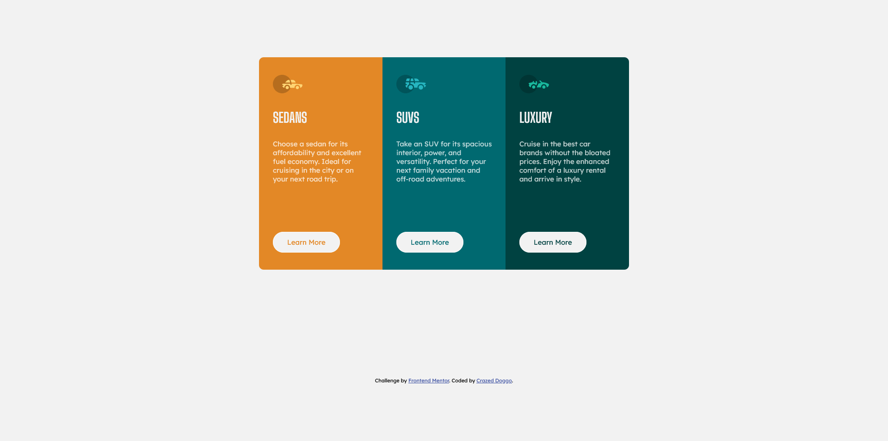

# Frontend Mentor - 3-column preview card component solution

This is a solution to the [3-column preview card component challenge on Frontend Mentor](https://www.frontendmentor.io/challenges/3column-preview-card-component-pH92eAR2-). Frontend Mentor challenges help you improve your coding skills by building realistic projects. 

## Table of contents

- [Overview](#overview)
  - [The challenge](#the-challenge)
  - [Screenshot](#screenshot)
  - [Links](#links)
- [My process](#my-process)
  - [Built with](#built-with)
  - [What I learned](#what-i-learned)
  - [Continued development](#continued-development)
  - [Useful resources](#useful-resources)
- [Author](#author)

## Overview

### The challenge

Users should be able to:

- View the optimal layout depending on their device's screen size
- See hover states for interactive elements

### Screenshot

### Links

- Solution URL: [https://github.com/CrazedDoggo/FEM-Three-Column-Card-Component](https://github.com/CrazedDoggo/FEM-Three-Column-Card-Component)
- Live Site URL: [https://crazeddoggo.github.io/FEM-Three-Column-Card-Component/](https://crazeddoggo.github.io/FEM-Three-Column-Card-Component/)

## My process

### Built with

- Semantic HTML5 markup
- CSS custom properties
- CSS animations
- CSS Grid
- Mobile-first workflow

### Continued development

Animations are great to add once the layout was completed. The slide-in animation was a very nice icing on the cake and made the components stand out.

This was my last "card" style exercise and I feel very comfortable with it. I'll be moving onto taking up 1-2 actual websites and then I'll be moving onto JavaScript if all goes well.

## Author

- GitHub - [CrazedDoggo](https://github.com/CrazedDoggo)
- Frontend Mentor - [@CrazedDoggo](https://www.frontendmentor.io/profile/CrazedDoggo)
